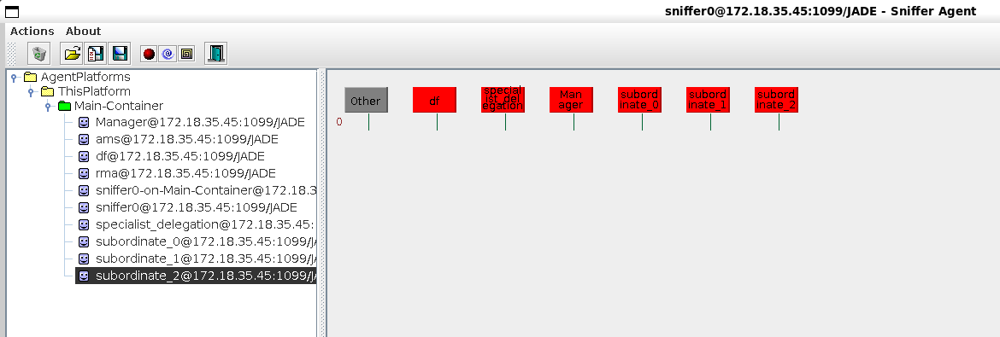
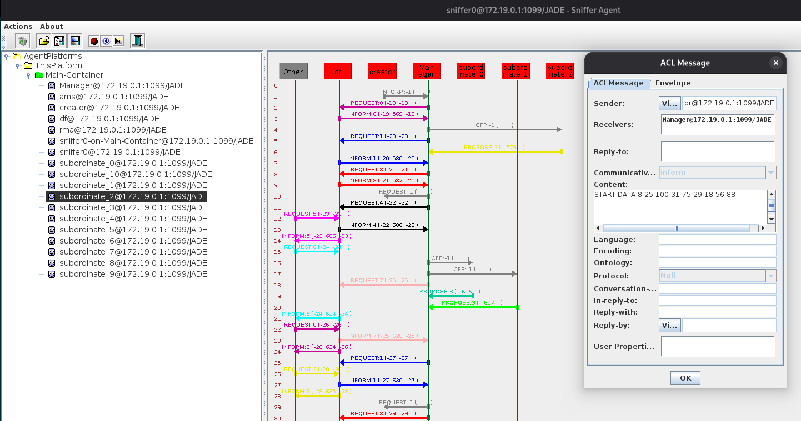
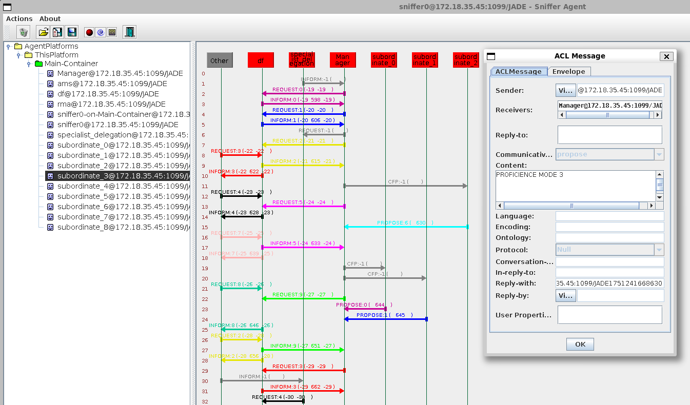
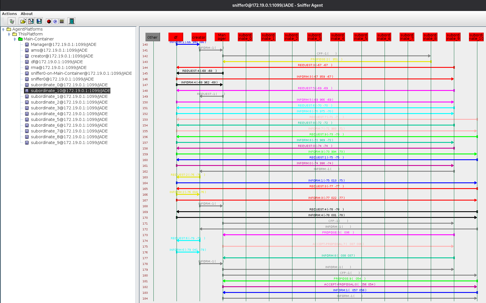

# Estrutura de Delegação por Especialistas

## Autores

| **Identificação** | **Nome** | **Formação** |
| :-: | :-: | :-: |
|  | André Corrêa da Silva | Graduando em Engenharia de Software (UnB) |
|  | Gabriel Mariano da Silva | Graduando em Engenharia de Software (UnB) |

*Tabela 1: Identificação dos Autores*

## Métricas do *Building Block*

[](https://sonarcloud.io/summary/new_code?id=tcc-sma-andre-gabriel_specialist-delegation-structure)
[](https://sonarcloud.io/summary/new_code?id=tcc-sma-andre-gabriel_specialist-delegation-structure)
[](https://sonarcloud.io/summary/new_code?id=tcc-sma-andre-gabriel_specialist-delegation-structure)

[](https://sonarcloud.io/summary/new_code?id=tcc-sma-andre-gabriel_specialist-delegation-structure)
[](https://sonarcloud.io/summary/new_code?id=tcc-sma-andre-gabriel_specialist-delegation-structure)
[](https://sonarcloud.io/summary/new_code?id=tcc-sma-andre-gabriel_specialist-delegation-structure)

[](https://sonarcloud.io/summary/new_code?id=tcc-sma-andre-gabriel_specialist-delegation-structure)

## Descrição

O *building block* contido neste repositório tem por objetivo a implementação de um sistema de decisão por especialistas, o qual utiliza da delegação de tarefas dentre os interessados. Entretanto, esse se difere ao buscar tomar uma decisão baseada em especialistas
que foram delegados para responder o que for requisitado. Nesse sistema, cada agente subordinado possui sua especialidade e um nível de proficiência atrelado.

Inicialmente, similarmente aos outros *building blocks* desenvolvidos, um agente *creator* instancia todos os agentes necessários para a execução das atividades desejadas. Então, logo em seguida, o mesmo envia ao *manager* uma mensagem contendo o conjunto de dados sobre os quais as operações listadas serão executadas, dando início assim à execução das atividades.

Recebidos os dados, o agente *manager* solicita, para cada uma das operações necessárias, a proficiência específica de cada um dos agentes nestas. Recebidas as proficiências por operação requisitada de cada um dos agentes subordinados, o agente manager avalia se a proficiência recebida é superior ao limite necessário para a operação em específico. Caso seja, a operação é enviada em conjunto aos dados para o agente subordinado, iniciando assim um *timeout* para o recebimento desta resposta. Caso contrário, o agente *manager* recusa o agente subordinado com proficiência inferior à necessária.

Caso nenhum agente possua a proficiência necessária para a operação a ser executada, o agente *manager* solicita ao agente creator a instanciação de um agente com tal especialidade, repetindo assim até que exista um agente com a proficiência desejada.

Caso o agente subordinado exceda o *timeout* definido para o envio das respostas, ele é adicionado à uma lista de agentes com *timeout*, da qual só poderá sair se retornar os resultados da operação.

Caso não seja encontrada uma especialidade necessária adotada por algum dos agentes subordinados, segue-se a lógica anterior de requisição ao agente *creator* para a criação de um novo agente com esta especialidade.

Recebidos todos os resultados das operações requisitadas, finaliza-se a execução das atividades.

Além disso, há também a possibilidade de ativação durante a execução do *building block* da funcionalidade de *malfunctioning agents*, a qual permitirá que os agentes sejam randomicamente inutilizados, não retornando nenhuma resposta para as operações solicitadas. Esta funcionalidade permite o uso mais direto da lógica de *timeout* disponibilizada pela estrutura.

## Projeto em Execução

Inicialmente, na *Figura 1*, é possível visualizar a partir do *sniffer* todos os agentes inicialmentes criados pelo *creator* para a realização das atividades do *building block*. Dentre estes, estão o agente *manager* e os agentes subordinados.



*Figura 1: Visualização dos Agentes pelo *Sniffer**

Logo em seguida, na *Figura 2*, é possível ver a mensagem enviada do *creator* para o *manager* solicitando a execução de todas as atividades em conjunto aos dados especificados.



*Figura 2: Mensagem de *Start* com os Dados Especificados*

Por conseguinte, na *Figura 3*, é possível ver o retorno de um agente subordinado ao *manager* com a proficiência de uma especialidade conforme requisição do mesmo.



*Figura 3: Mensagem com Informe de Proficiência de uma Especialidade*

Já na *Figura 4*, é possível ver a mensagem solicitando a criação de um agente com uma devida especialidade enviada pelo *manager* para o agente *creator*.


*Figura 4: Mensagem Solicitando a Criação de um Agente com uma Devida Especialidade*

Por fim, na *Figura 5*, é possível ver o número de agentes subordinados criados para a devida aplicação de todas as operações sobre os dados recebidos pelo *manager*.



*Figura 5: Visualização de Todos os Agentes Após Aplicação de Todas as Operações*

## Requisitos Técnicos

1. **Identificação de Agentes com a Devida Especialidade:** o agente *manager* deve ser capaz de encontrar e escolher agentes subordinados com a devida especialidade necessária para a delegação das atividades a serem realizadas;
2. **Escolha de Agentes com Proficiência Adequada:** uma vez listados os agentes subordinados com a devida especialidade necessária, o agente *manager* deve ser capaz de requisitar aos mesmos suas proficiências nas devidas especialidades. Por sua vez, os agentes subordinados devem ser capazes de informar aos *manager*es suas proficiências, que devem ser usadas por eles para a avaliação da possibilidade de execução das operações por estes;
3. **Delegação de Atividades:** tendo encontrado agentes com a especialidade adequada e a proficiência superior a um limiar mínimo na mesma, o agente *manager* deve ser capaz de solicitar ao subordinado a realização da operação específica sobre um conjunto de dados;
4. ***Timeout* de Espera por Respostas:** uma vez solicitada a execução das operações específicas para os agentes subordinados, o agente *manager* deve ser capaz de iniciar um *timeout* para aguardar o envio das respostas;
5. **Execução das Operações:** recebida a operação e o conjunto de dados pelo *manager*, o agente subordinado deve ser capaz de executar a atividade requisitada sobre os mesmos;
6. **Retorno dos Resultados das Operações:** uma vez aplicada a operação sobre o conjunto de dados recebido, o agente subordinado deve ser capaz de retornar ao agente *manager* os resultados obtidos;
7. **Criação de Agentes com a Devida Especialidade:** caso não seja encontrado nenhum agente com a devida especialidade ou com o grau de proficiência requisitado, o agente *manager* deve ser capaz de solicitar ao agente *creator* a criação de um agente com tal especialidade. O *creator*, por sua vez, deve ser capaz de efetuar tal criação.

## Requisitos para Execução

Para a efetiva execução do *building block* disposto no repositório, se faz necessária a instalação e configuração do *software* *Maven* em sua máquina. Para tal, basta seguir as instruções de instalação dispostas na [**documentação do *Maven***](https://maven.apache.org/install.html). Para o desenvolvimento do *building block*, foi utilizado o *Maven* na versão **3.8.7**. Além disso, todas as instruções de execução consideram o uso de sistemas operacionais baseados em *Linux*.

## Como Executar?

Para a execução do *building block*, é possível utilizar-se do *Makefile* adicionado ao repositório ao seguir os seguintes passos:

- Primeiramente, clone o repositório em sua máquina:

```bash
git clone https://github.com/SMA-building-blocks/specialist-delegation.git
```

- Em seguida, vá para a pasta do repositório:

```bash
cd specialist-delegation
```

- Para realizar a *build* do projeto e executá-lo em seguida, execute o seguinte comando:

```bash
make build-and-run
```

> 🚨 **IMPORTANTE:** Ao executar o projeto, primeiro será realizada a criação de todos os agentes participantes. Logo após, para a efetiva realização do propósito desejado pelo *building block*, é necessário pressionar **ENTER** no terminal para a continuidade da execução do código. Esta decisão foi tomada em prol de uma facilitação do uso do *sniffer* para a visualização da comunicação entre os agentes participantes.

- É possível realizar apenas a *build* do projeto com o seguinte comando:

```bash
make build
```

- Similarmente, é possível rodar o projeto após a geração de sua build com o seguinte comando:

```bash
make run
```

- É possível alterar a quantidade de agentes participantes ao passar a variável **QUORUM** seguida do número desejado, como pode ser visto abaixo (onde N representa o número desejado de agentes):

```bash
make build-and-run QUORUM=N"
```

- É possível também alterar a quantidade de especialidades que cada agente subordinado possui em sua instanciação ao definir a variável **SPECS** seguida do número desejado, como pode ser visto abaixo (onde N representa o número desejado de especialidades):

```bash
make build-and-run SPECS=N"
```

- Também é possível ativar a funcionalidade de *malfunction* dos agentes subordinados ao definir a variável **MALFUNCTION** com o valor **1**, como pode ser visto abaixo:

```bash
make build-and-run MALFUNCTION=1"
```

- Por fim, para apagar os arquivos derivados da *build* do projeto, execute o seguinte comando:

```bash
make clean
```

- Para ter acesso a uma série de informações úteis para a execução do building block, basta executar o seguinte comando:

```bash
make help
```

## Referências

[*Jade Project*](https://jade-project.gitlab.io/). <br />
[*Maven*](https://maven.apache.org/).
